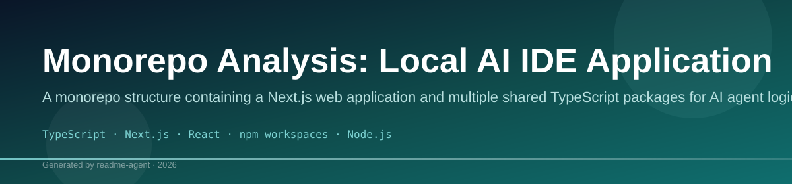
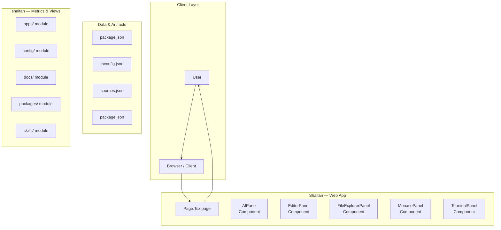
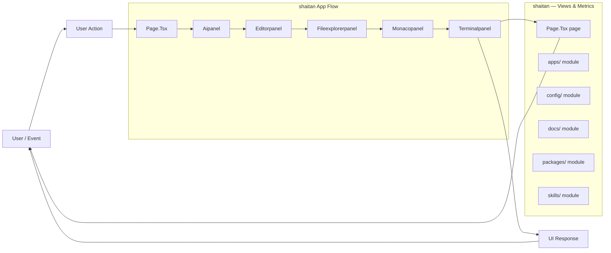
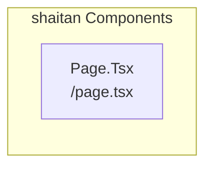
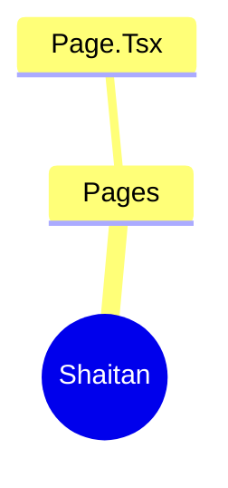
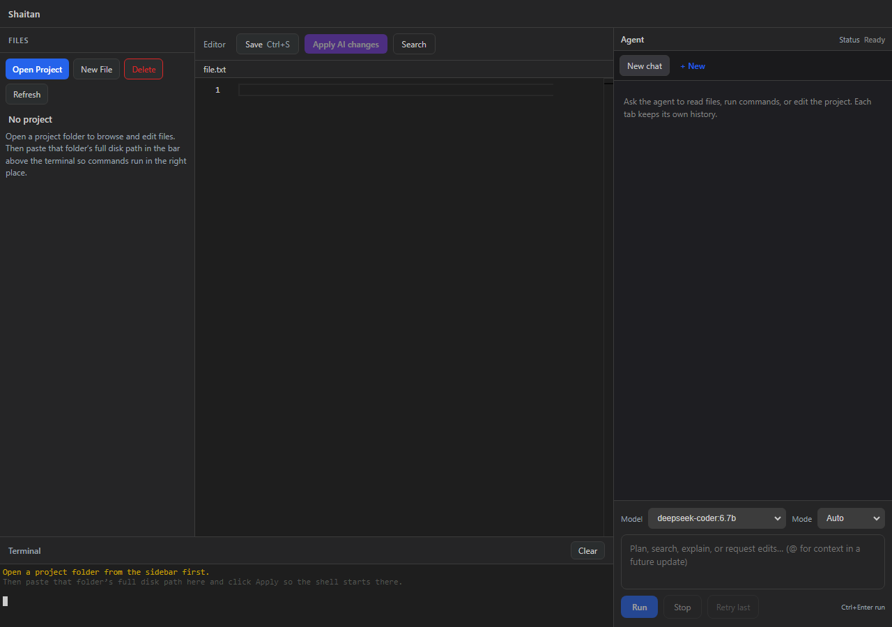

# AI Agent Development Monorepo

A monorepo containing a Next.js web application and various internal packages for building AI agents, including tools, template engines, and communication clients.

## Overview

This repository is structured as a monorepo using workspaces, managing multiple related applications and libraries. The core functionality revolves around building and executing AI agents. The web application (`apps/web`) serves as the primary user interface, while internal packages handle specialized logic such as tool definitions, template rendering, and communication with external services like Ollama.

## Key Features

- Web UI for AI Agent interaction (Next.js)
- Tool definition and management (using `@local-ai-ide/tools`)
- Template rendering engine for prompt construction (using `@local-ai-ide/template-engine`)
- Ollama client integration for local LLM communication (using `@local-ai-ide/ollama-client`)
- Agent orchestration logic (using `@local-ai-ide/agent`)
- Shared TypeScript types across all packages (using `@local-ai-ide/shared-types`)

## Technology Stack

- TypeScript
- Next.js
- React
- Node.js
- Zod
- Ollama

# 1. 🧭 HIGH LEVEL DESIGN (HLD)

See [`docs/HLD.md`](docs/HLD.md) for the full architecture and flow.

# 2. ⚙️ LOW LEVEL DESIGN (LLD)

See [`docs/LLD.md`](docs/LLD.md) for module contracts and interaction design.

# 3. 📁 PROJECT STRUCTURE

```text
local-ai-ide/
├── apps/
│   └── web/
│       ├── app/
│       │   ├── api/agent/run/route.ts
│       │   ├── globals.css
│       │   ├── layout.tsx
│       │   └── page.tsx
│       ├── components/
│       │   ├── ChatPanel.tsx
│       │   ├── FileExplorer.tsx
│       │   └── MonacoPanel.tsx
│       ├── next.config.ts
│       ├── package.json
│       └── tsconfig.json
├── claude-code/                         (existing external source)
├── skills/
│   ├── refactor-safe-edit/SKILL.md
│   └── ui-template-assembler/SKILL.md
├── vectorless/
│   └── README.md
├── templates/
│   ├── dashboard/AnalyticsDashboard.tsx
│   ├── hero/GradientHero.tsx
│   ├── navbar/ModernNavbar.tsx
│   └── manifest.json
├── docs/
│   ├── HLD.md
│   └── LLD.md
├── packages/
│   ├── agent/src/agent-loop.ts
│   ├── mcp-client/src/mcp-client.ts
│   ├── ollama-client/src/index.ts
│   ├── shared-types/src/index.ts
│   ├── skills-runtime/src/skill-loader.ts
│   ├── template-engine/src/template-selector.ts
│   ├── tools/src/tool-registry.ts
│   ├── tools/src/types.ts
│   ├── tools/src/tools/bash-tool.ts
│   ├── tools/src/tools/file-edit-tool.ts
│   ├── tools/src/tools/file-read-tool.ts
│   ├── tools/src/tools/file-write-tool.ts
│   └── tools/src/tools/grep-tool.ts
├── package.json
└── tsconfig.base.json
```

# 4. 🔑 CORE IMPLEMENTATION (REAL CODE)

## Agent Loop
- `packages/agent/src/agent-loop.ts`: iterative planner/executor loop.
- Supports:
  - tool execution (`action=tool`)
  - MCP execution (`action=mcp`)
  - skill/vectorless/template prompt injection
  - bounded reasoning turns (`maxSteps`)

## Tool Interface + Example Tools
- `packages/tools/src/types.ts` defines strict interface:
  - `name`, `description`, `inputSchema`, `execute()`
- Required tools implemented in `packages/tools/src/tools/`:
  - `FileReadTool`
  - `FileWriteTool`
  - `FileEditTool`
  - `GrepTool`
  - `BashTool`

## Skill Loader
- `packages/skills-runtime/src/skill-loader.ts`
- Dynamically loads `skills/<skill-name>/SKILL.md`
- Parses frontmatter + instructions and injects relevant skills into prompt context

## Vectorless Selector
- `packages/vectorless-engine/src/selector.ts`
- Stage 1: LLM chooses relevant files from metadata
- Stage 2: LLM chooses relevant line ranges from selected file previews
- Returns only selected snippets as context (no embeddings, no vector DB)

## Template Selector + Adapter
- `packages/template-engine/src/template-selector.ts`
- Reads `templates/manifest.json`
- Selects templates through LLM reasoning
- Adapts selected template source according to user request
- Enforces template-first generation (select + modify)

## MCP Client
- `packages/mcp-client/src/mcp-client.ts`
- Implements server registry, stdio MCP connection, tool listing, and tool invocation via `server.tool`
- Supports external MCP tools, including `browser.fetch` when present

# 5. 🔄 END-TO-END EXECUTION FLOW

1. User prompt enters `apps/web` chat panel.
2. `POST /api/agent/run` initializes `AgentCore`.
3. `SkillLoader` injects task-specific skill instructions.
4. `VectorlessSelector` performs:
   - file selection
   - section selection
5. `TemplateEngine` selects and adapts local templates.
6. Agent loop plans actions and calls:
   - local tools (file/search/bash)
   - MCP tools (`server.tool`)
7. Tool/MCP outputs feed back into loop.
8. Agent returns final response to UI.
9. Monaco panel displays generated/edited code output.

# 6. ⚠️ DESIGN CONSTRAINTS

- Runs locally with Ollama (`http://127.0.0.1:11434`)
- No vector DB and no embedding-based retrieval
- Modular packages with clear contracts
- No monolithic runtime; each subsystem is replaceable
- Web UI is Next.js-based and ready to be wrapped in Tauri/Electron later

# 7. 🚀 MVP BUILD PLAN

## Phase 1 (Day 1-2): Core Runtime
- workspace bootstrap
- strict tool contracts + required tools
- agent loop with bounded execution

## Phase 2 (Day 3): Context + Skills
- dynamic skill loading from SKILL.md
- vectorless file/section selection pipeline

## Phase 3 (Day 4): UI Generation + MCP
- template metadata library + selector + adapter
- MCP registry and external tool calls

## Phase 4 (Day 5): Product Surface
- React + Monaco UI
- API endpoint wiring + flow integration
- smoke tests and hardening

# 8. 🔥 OPTIONAL ADVANCED FEATURES

- Multi-agent execution coordinator with role-specialized workers
- Persistent local memory graph (file-level, task-level)
- Skill marketplace manifest and signed skill bundles
- Plugin ecosystem for custom tools and custom UI blocks

## Run Locally

```bash
cd local-ai-ide
npm install
npm run dev:web
```

## Model Recommendations

The agent's ability to autonomously edit files and run terminal commands depends heavily on the Ollama model you use. **Not all models can follow the structured JSON format reliably.**

### ✅ Recommended Models (Autonomous Tool Use)
These models can reliably parse instructions, use tools, edit files, and run terminal commands:

- **`qwen2.5:7b`** - Best balance of speed and capability for coding tasks
- **`deepseek-coder:6.7b`** - Excellent for code editing and terminal commands  
- **`llama3.1:8b`** - Strong general-purpose reasoning and tool use
- **`qwen2.5-coder:7b`** - Specialized for code generation and refactoring

Install with: `ollama pull qwen2.5:7b`

### ⚠️ Limited Models (May Struggle with Tools)
These models work for simple tasks but often produce malformed JSON or ignore tool schemas:

- **`phi3:mini`** - Too small, frequently returns invalid JSON
- **`phi4:mini`** - Better than phi3 but still unreliable for complex tasks
- **`qwen3:4b`** - Works for basic tasks but may fail on multi-step workflows
- **`gemma3:4b`** - Similar limitations to qwen3:4b

### 🚀 Advanced Models (Best Performance)
For complex multi-file refactoring and sophisticated reasoning:

- **`qwen2.5:14b`** or **`qwen2.5:32b`** (requires more RAM)
- **`llama3.3:70b`** (requires 40GB+ RAM, best overall quality)
- **`deepseek-coder-v2:16b`**

Set optional env vars (e.g. in `apps/web/.env.local`):

```bash
# Recommended: Use a 7B+ model for reliable autonomous tool use
OLLAMA_MODEL=qwen2.5:7b

# Other good options:
# OLLAMA_MODEL=deepseek-coder:6.7b
# OLLAMA_MODEL=llama3.1:8b
# OLLAMA_MODEL=qwen2.5-coder:7b

# ⚠️ NOT recommended for agent tasks (too small/unreliable):
# OLLAMA_MODEL=phi3:mini
# OLLAMA_MODEL=phi4:mini
# OLLAMA_MODEL=qwen3:4b

# If Ollama listens elsewhere (e.g. Docker):
# OLLAMA_BASE_URL=http://127.0.0.1:11434

# Agent step limit (default 64, max 100):
# AGENT_MAX_STEPS=80
```

If you see **`404 Not Found`** from Ollama while the daemon is running, the **model name is wrong or not installed** — not a dead server. Run `ollama pull <name>` or set `OLLAMA_MODEL` to a model from `ollama list`.

## Troubleshooting

### Agent returns garbage or "Missing `action`" errors
- **Cause**: Model is too small to follow the JSON schema (common with `phi3:mini`, `phi4:mini`)
- **Fix**: Switch to a recommended model like `qwen2.5:7b` or `deepseek-coder:6.7b`
  ```bash
  ollama pull qwen2.5:7b
  # Then set in .env.local or select in UI
  ```

### Agent hits step limit (64 steps)
- **Cause**: Model keeps calling tools without finishing, or task is very complex
- **Fix**: Raise limit via `AGENT_MAX_STEPS=100` in `.env.local`, or break task into smaller requests

### Terminal not connecting / "Not connected to shell"
- **Cause**: Workspace path not set (dev mode now auto-sets on startup)
- **Fix**: Refresh the page; terminal should auto-connect. If not, paste workspace path and click Apply.

### Agent can't type commands / terminal unresponsive
- **Cause**: Focus handling bug (now fixed)
- **Fix**: Click anywhere in the terminal panel; keyboard should route to shell immediately.
# shaitan

## Setup Guide

### Frontend Setup

```bash
cd apps/web
npm install
npm run dev     # development
npm run build && npm start   # production
```

Open `http://127.0.0.1:3000` (or the port shown in the terminal).

### Running the Application

1. **Start web app** — `npm run dev` in `apps/web/`

```bash
cd apps/web
npm install
npm run dev
```

## System Architecture

High-level system design, data flows, API map, and workflow pipelines derived from the repository structure.

### System Architecture



### Data Flow & Charts Pipeline



### Component & API Map



### Application Page Map



## Application Pages

Screenshots captured from the running application. Each page is listed with its function.

#### Home

Application page at `/`


